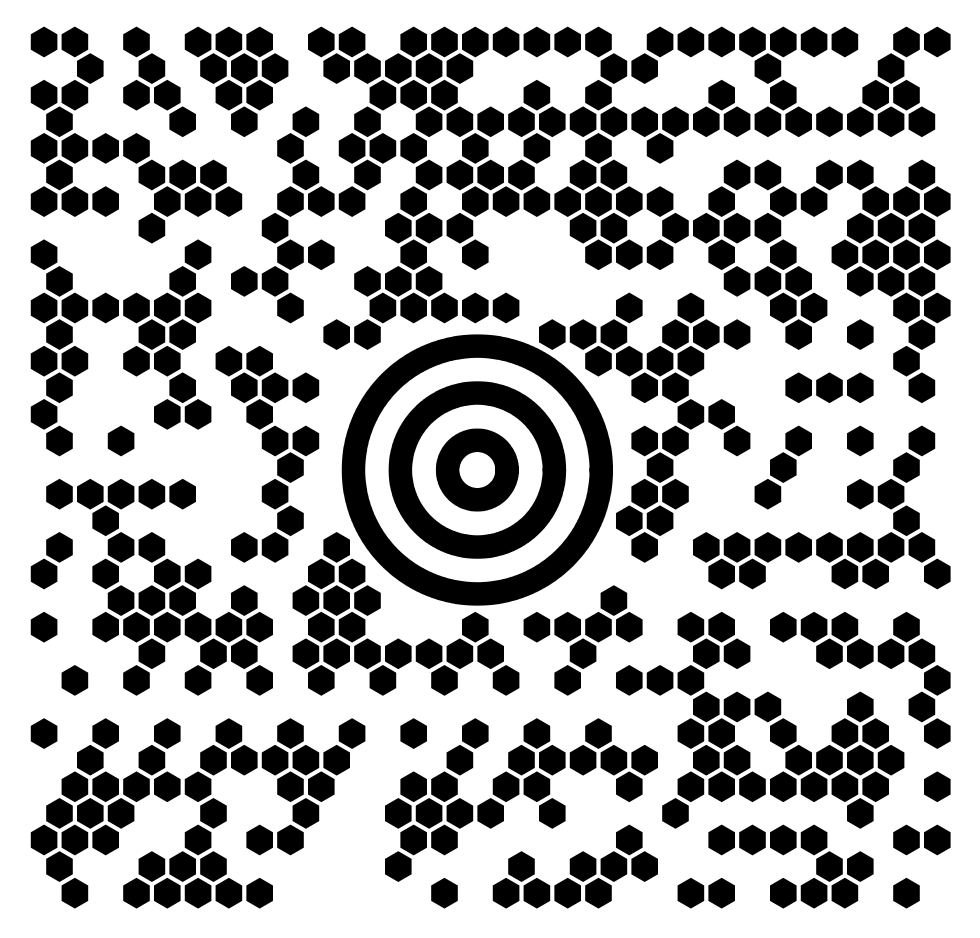

# maxicode
Library for creating UPS MaxiCodes written in pure Go

## Usage

```go

inputData := "[)>" + RS + "01" + GS + "09651147" + GS + "276" + GS + "066" + GS + "1Z12345677" + GS + "UPSN" + GS + "1X2X3X" + GS + "187" + GS + "" + GS + "1/1" + GS + "10" + GS + "N" + GS + "5 WALDSTRASSE" + GS + "COLOGNE" + GS + "" + RS + "" + EOT
mode := 3
eci := 0
dpmm := 35.0

grid, err := maxicode.Encode(mode, eci, inputData)
if grid != nil {
    t.Fatal(err.Error())
}

err = grid.Draw(dpmm).SavePNG("maxicode.png")
if err != nil {
    t.Fatal(err.Error())
}

```

Above code will produce the following image:



You can use different dpmm to scale maxicodes up/down. Normally scaleFactors should depend on your dpi/dpmm

## Contributors
 
Special thanks for:
* [ZintNET - Barcode Library](https://sourceforge.net/projects/zintnet/). That repository served as a source of inspiration for this particular library